# Diagrama Entidade-Relacionamento (DER) — Orbyt SOS

> **Referência:** `database_estrutura.sql` (28 tabelas) — banco `orbyt`, `utf8mb4`/`utf8mb4_0900_ai_ci`.
> **Gerado em:** 2026-09-15. Renderizado com Mermaid (`erDiagram`) — suportado no GitHub.

## 1. Visão por domínio

| Domínio | Tabelas |
|---|---|
| **Cadastro base** | `tb_pessoa`, `tb_pessoa_fisica`, `tb_pessoa_juridica`, `tb_contato`, `tb_endereco`, `tb_cep`, `tb_user` |
| **Catálogos / lookup** | `tb_sexo`, `tb_estado_civil`, `tb_tpLogradouro`, `tb_tpUso`, `tb_status`, `tb_forma_pagamento`, `tb_local_pernoite`, `tb_ocorrencia`, `tb_tipo_assistencia`, `tb_configuracao`, `orbyt_meta` |
| **Veículos e apólices** | `tb_veiculo`, `tb_apolice`, `tb_apolice_ocorrencia` |
| **Solicitações e atendimento** | `tb_solicitacao_local`, `tb_solicitacao`, `tb_assistencia`, `tb_solicitacao_assistencia`, `tb_historico_status`, `tb_pergunta`, `tb_status_ocorrencia`, `tb_ocorrencia_assistencia`, `tb_analista_seguradora` |

## 2. Diagrama completo (Mermaid `erDiagram`)

```mermaid
erDiagram
    %% ===== Sistema / meta =====
    orbyt_meta {
        varchar chave PK
        varchar valor
    }

    %% ===== Lookups e catálogos =====
    tb_sexo {
        int id_sexo PK
        varchar sexo
    }
    tb_estado_civil {
        int id_estado_civil PK
        varchar estado
    }
    tb_tpLogradouro {
        int id_tpLogradouro PK
        varchar tipo
    }
    tb_tpUso {
        int id_tpUso PK
        varchar tipo
    }
    tb_forma_pagamento {
        int id_forma_pagamento PK
        varchar forma
    }
    tb_local_pernoite {
        int id_local_pernoite PK
        varchar local
    }
    tb_status {
        int id_status PK
        varchar codigo
        varchar rotulo
        varchar entidade
    }
    tb_ocorrencia {
        int id_ocorrencia PK
        varchar codigo
        varchar nome
        varchar descricao
        bool ativo
    }
    tb_tipo_assistencia {
        int id_tipo_assistencia PK
        varchar codigo
        varchar nome
        varchar descricao
        bool ativo
    }
    tb_configuracao {
        int id_configuracao PK
        varchar pais
        text mensagem
        json servicos_json
    }

    %% ===== Cadastro =====
    tb_pessoa {
        int id_pessoa PK
        datetime data_cadastro
        bool isJuridico
    }
    tb_pessoa_fisica {
        int id_pf PK, FK
        varchar nome
        varchar cpf UK
        int fk_sexo FK
        date data_nascimento
        varchar cnh UK
        int fk_estado_civil FK
        int fk_status FK
        varchar cpf_mascarado
    }
    tb_pessoa_juridica {
        int id_pj PK, FK
        bool isSeguradora
        varchar razao_social UK
        varchar nome_fantasia UK
        varchar cnpj UK
        int fk_status FK
        varchar cnpj_mascarado
    }
    tb_contato {
        int id_contato PK
        int fk_pessoa FK
        bool principal
        int fk_status FK
        varchar tipo_contato
        varchar valor_contato
        datetime data_criacao
        varchar rotulo
    }
    tb_endereco {
        int id_endereco PK
        int fk_pessoa FK
        varchar logradouro
        varchar bairro
        int fk_tpLogradouro FK
        varchar cep
        varchar cidade
        varchar estado
        varchar pais
        varchar complemento
        datetime data_criacao
    }
    tb_cep {
        int id_cep PK
        varchar logradouro
        varchar bairro
        varchar cidade
        varchar estado
        varchar cep
    }
    tb_user {
        int id_user PK
        int fk_pessoa FK
        varchar login UK
        varchar senha
        varchar perfil
        int fk_status FK
        varchar nome_exibicao
        varchar email
        int fk_seguradora FK
    }

    %% ===== Veículos e apólices =====
    tb_veiculo {
        int id_veiculo PK
        int fk_pessoa FK
        varchar marca
        varchar modelo
        varchar versao
        int ano_fabricado
        int ano_modelo
        varchar placa UK
        varchar chassi UK
        varchar valor_fipe
        int fk_tpUso FK
        bool blindado
        varchar placa_mascarada
    }
    tb_apolice {
        int id_apolice PK
        varchar numero_apolice
        int fk_pessoa FK
        int fk_segurado FK
        int fk_veiculo FK
        datetime data_inicio
        datetime data_fim
        float cobertura
        varchar assistencia
        varchar endosso
        int versao
        varchar perfil
        int fk_local_pernoite FK
        int fk_status FK
        int fk_forma_pagamento FK
        varchar numero_apolice_mascarado
        bool possui_solicitacao_ativa
    }
    tb_apolice_ocorrencia {
        int id_apolice_ocorrencia PK
        int fk_apolice FK
        int fk_ocorrencia FK
    }
    tb_status_ocorrencia {
        int id_status_ocorrencia PK
        int fk_apo_ocorrencia FK
        varchar status
    }
    tb_ocorrencia_assistencia {
        int id_ocorrencia_assistencia PK
        varchar descricao
        varchar local
        bool isMachucado
        int fk_apo_ocorrencia FK
        int fk_assistencia FK
        int fk_status FK
    }

    %% ===== Solicitações e atendimento =====
    tb_solicitacao_local {
        int id_local PK
        varchar endereco
        varchar numero_local
        varchar cidade
        varchar estado
        varchar ponto_referencia
    }
    tb_solicitacao {
        int id_solicitacao PK
        varchar id_solicitacao_cliente UK
        varchar protocolo_solicitacao UK
        varchar numero_solicitacao UK
        varchar descricao_evento
        bool possui_feridos
        bool risco_imediato
        varchar prioridade
        datetime data_criacao_cliente
        datetime data_recebimento
        datetime data_decisao
        varchar motivo_recusa
        int version
        int fk_apolice FK
        int fk_pessoa FK
        int fk_seguradora FK
        int fk_veiculo FK
        int fk_tipo_ocorrencia FK
        int fk_local FK, UK
        int fk_status FK
        int fk_analista_responsavel FK
    }
    tb_assistencia {
        int id_assistencia PK
        int fk_id_tipo_assistencia FK
        varchar nome
        varchar descricao
        int fk_status FK
    }
    tb_solicitacao_assistencia {
        int id_solicitacao_assistencia PK
        varchar status
        varchar comentario
        datetime data_inclusao
        datetime data_atualizacao
        int version
        int fk_solicitacao FK
        int fk_assistencia FK
        int fk_usuario_responsavel FK
    }
    tb_historico_status {
        int id_historico PK
        varchar status
        datetime data_status
        varchar comentario
        varchar nome_responsavel
        int fk_solicitacao FK
        int fk_usuario_responsavel FK
    }
    tb_pergunta {
        int id_pergunta PK
        varchar origem
        varchar tipo
        bool necessita_taxi
        int qtd_passageiros
        bool necessita_acessibilidade
        int qtd_criancas
        int qtd_animais
        varchar bagagem
        varchar observacoes
        datetime data_criacao
        datetime data_resposta
        int version
        int fk_solicitacao FK
        int fk_assistencia FK
        int fk_status FK
    }
    tb_analista_seguradora {
        int id_analista_seguradora PK
        int fk_analista FK
        int fk_seguradora FK
        bool ativo
        datetime data_vinculo
    }

    %% ===== Relacionamentos =====
    tb_pessoa ||--o| tb_pessoa_fisica : "id_pessoa = id_pf"
    tb_pessoa ||--o| tb_pessoa_juridica : "id_pessoa = id_pj"
    tb_pessoa_fisica }o--|| tb_sexo : fk_sexo
    tb_pessoa_fisica }o--|| tb_estado_civil : fk_estado_civil
    tb_pessoa_fisica }o--|| tb_status : fk_status
    tb_pessoa_juridica }o--|| tb_status : fk_status
    tb_user }o--|| tb_pessoa : fk_pessoa
    tb_user }o--|| tb_status : fk_status
    tb_user }o--o| tb_pessoa_juridica : "fk_seguradora (seguradora fixa)"
    tb_contato }o--|| tb_pessoa : fk_pessoa
    tb_contato }o--|| tb_status : fk_status
    tb_endereco }o--|| tb_pessoa : fk_pessoa
    tb_endereco }o--|| tb_tpLogradouro : fk_tpLogradouro
    tb_veiculo }o--|| tb_pessoa : fk_pessoa
    tb_veiculo }o--|| tb_tpUso : fk_tpUso

    tb_apolice }o--|| tb_pessoa : fk_pessoa
    tb_apolice }o--|| tb_pessoa_juridica : "fk_segurado (seguradora)"
    tb_apolice }o--|| tb_veiculo : fk_veiculo
    tb_apolice }o--|| tb_local_pernoite : fk_local_pernoite
    tb_apolice }o--|| tb_forma_pagamento : fk_forma_pagamento
    tb_apolice }o--|| tb_status : fk_status
    tb_apolice_ocorrencia }o--|| tb_apolice : fk_apolice
    tb_apolice_ocorrencia }o--|| tb_ocorrencia : fk_ocorrencia
    tb_status_ocorrencia }o--|| tb_apolice_ocorrencia : fk_apo_ocorrencia
    tb_ocorrencia_assistencia }o--|| tb_apolice_ocorrencia : fk_apo_ocorrencia
    tb_ocorrencia_assistencia }o--|| tb_tipo_assistencia : fk_assistencia
    tb_ocorrencia_assistencia }o--|| tb_status : fk_status

    tb_solicitacao }o--|| tb_apolice : fk_apolice
    tb_solicitacao }o--|| tb_pessoa : fk_pessoa
    tb_solicitacao }o--|| tb_pessoa_juridica : fk_seguradora
    tb_solicitacao }o--|| tb_veiculo : fk_veiculo
    tb_solicitacao }o--|| tb_ocorrencia : fk_tipo_ocorrencia
    tb_solicitacao }o--|| tb_solicitacao_local : fk_local
    tb_solicitacao }o--|| tb_status : fk_status
    tb_solicitacao }o--o| tb_user : fk_analista_responsavel
    tb_assistencia }o--|| tb_tipo_assistencia : fk_id_tipo_assistencia
    tb_assistencia }o--|| tb_status : fk_status
    tb_solicitacao_assistencia }o--|| tb_solicitacao : fk_solicitacao
    tb_solicitacao_assistencia }o--|| tb_assistencia : fk_assistencia
    tb_solicitacao_assistencia }o--|| tb_user : fk_usuario_responsavel
    tb_historico_status }o--|| tb_solicitacao : fk_solicitacao
    tb_historico_status }o--o| tb_user : fk_usuario_responsavel
    tb_pergunta }o--|| tb_solicitacao : fk_solicitacao
    tb_pergunta }o--o| tb_assistencia : fk_assistencia
    tb_pergunta }o--|| tb_status : fk_status
    tb_analista_seguradora }o--|| tb_user : fk_analista
    tb_analista_seguradora }o--|| tb_pessoa_juridica : fk_seguradora
```

## 3. Legenda de cardinalidade

| Símbolo | Significado |
|---|---|
| `||--o|` | 1 : 0..1 (muitos-para-um opcional) |
| `||--||` | 1 : 1 (obrigatório nos dois lados) |
| `}o--||` | 0..n : 1 (opcional no lado da entidade "pai") |
| `}o--o|` | 0..n : 0..1 |

> **Chaves de atributo no Mermaid:** `PK` (Primary Key), `FK` (Foreign Key) e `UK`
> (Unique Key — o que em SQL costuma ser `UQ`/UNIQUE). O Mermaid **não** aceita `UQ`.

## 4. Notas de design importantes

- **`tb_status`** é a base da máquina de estados: guarda `codigo` + `rotulo` por `entidade`
  (APOLICE, OCORRENCIA, USUARIO, PESSOA, ASSISTENCIA, SOLICITACAO, ASSISTENCIA_SOLICITACAO, PERGUNTA, PRESTADOR).
- **Mascaramento:** `cpf_mascarado`, `cnpj_mascarado`, `placa_mascarada`, `numero_apolice_mascarado`
  são campos preenchidos pela API (as colunas reais completas nunca são expostas).
- **Optimistic locking:** `tb_solicitacao.version`, `tb_solicitacao_assistencia.version`,
  `tb_pergunta.version` e `tb_apolice.versao` controlam conflitos de concorrência (409 `REQUEST_VERSION_CONFLICT`).
- **Sync/SSE:** `orbyt_meta` guarda as chaves `revision` e `updated_at` — incrementadas
  atomicamente (`CAST(valor AS UNSIGNED) + 1`) em toda transação de escrita;
  `GET /api/v1/sync/version` e `GET /api/v1/sync/events` consomem essa chave.
- **Apólice ativa:** `tb_apolice.possui_solicitacao_ativa` é realimentada pela API
  (set 1 ao criar solicitação via `Idempotency-Key`, reset a 0 na conclusão/recusa).
- **Analista × seguradora:** `tb_user.fk_seguradora` é a seguradora fixa de um analista;
  `tb_analista_seguradora` permite vínculos múltiplos/ativos.
- **Sequência da solicitação:** `numero_solicitacao` segue `ORB-{YYYY}-{seq}`, com `protocolo_solicitacao` único.

## 5. Índices definidos no schema

| Índice | Tabela | Colunas | Uso |
|---|---|---|---|
| `idx_solicitacao_seguradora_status` | `tb_solicitacao` | `(fk_seguradora, fk_status, prioridade, data_recebimento)` | Fila do admin |
| `idx_solicitacao_pessoa_data` | `tb_solicitacao` | `(fk_pessoa, data_recebimento DESC)` | Listagem do cliente |
| `idx_solicitacao_apolice` | `tb_solicitacao` | `(fk_apolice)` | Checagem de solicitação ativa |
| `idx_historico_solicitacao_data` | `tb_historico_status` | `(fk_solicitacao, data_status)` | Ordenação do histórico |
| `idx_assistencia_solicitacao` | `tb_solicitacao_assistencia` | `(fk_solicitacao, status)` | Assistências por solicitação |
| `idx_analista_seguradora_analista` | `tb_analista_seguradora` | `(fk_analista, ativo)` | Lookup analista→seguradoras |
| `idx_analista_seguradora_seguradora` | `tb_analista_seguradora` | `(fk_seguradora, ativo)` | Lookup seguradora→analistas |